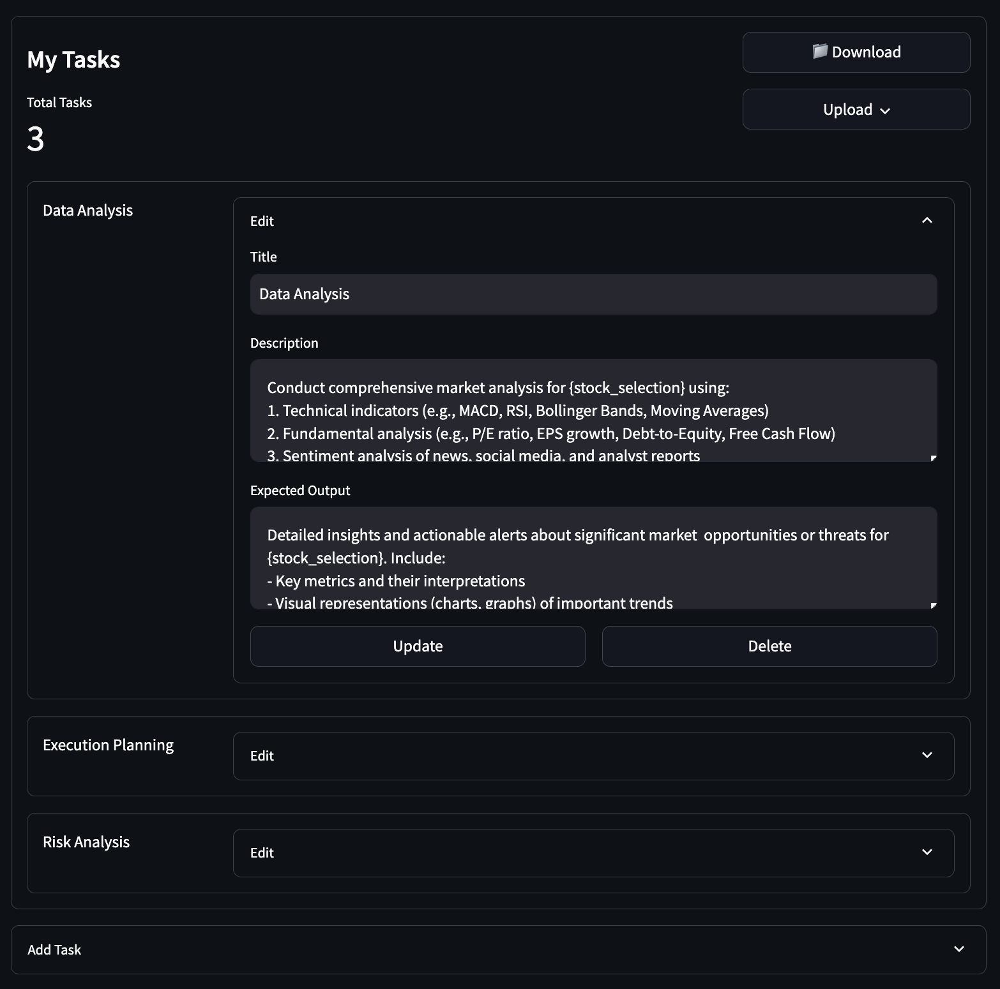
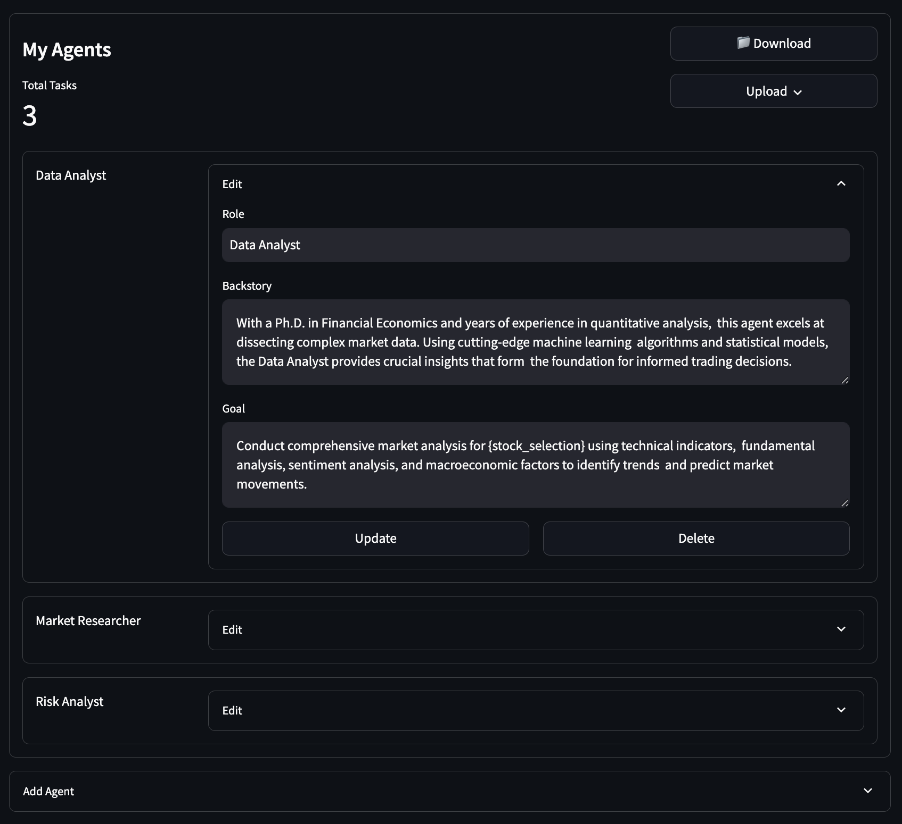
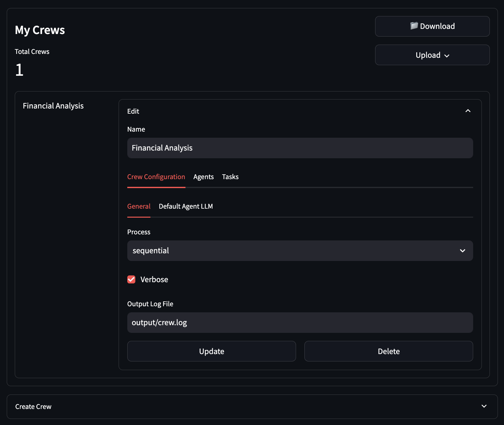
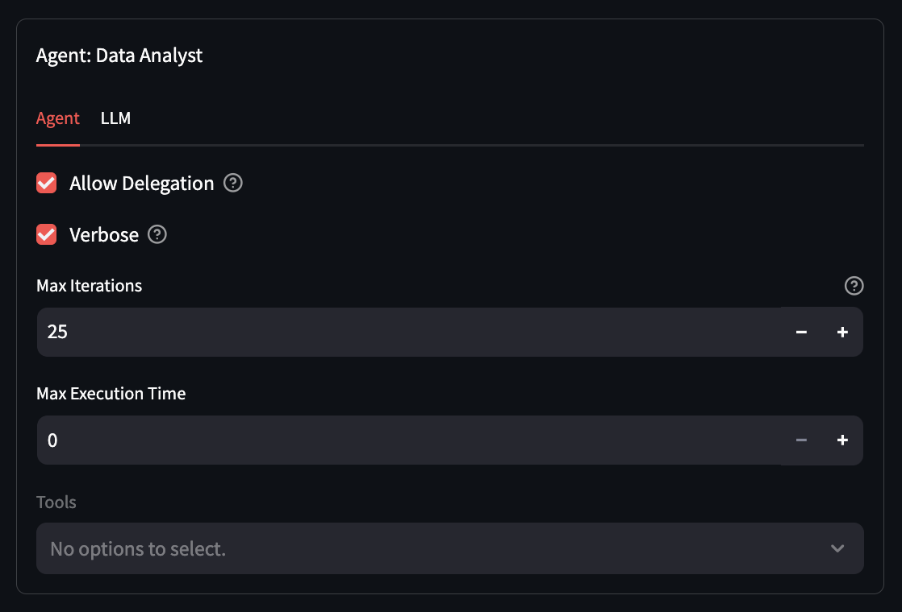
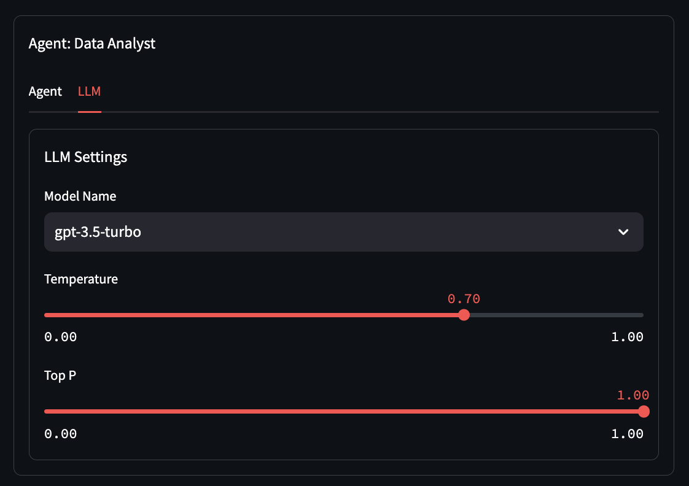
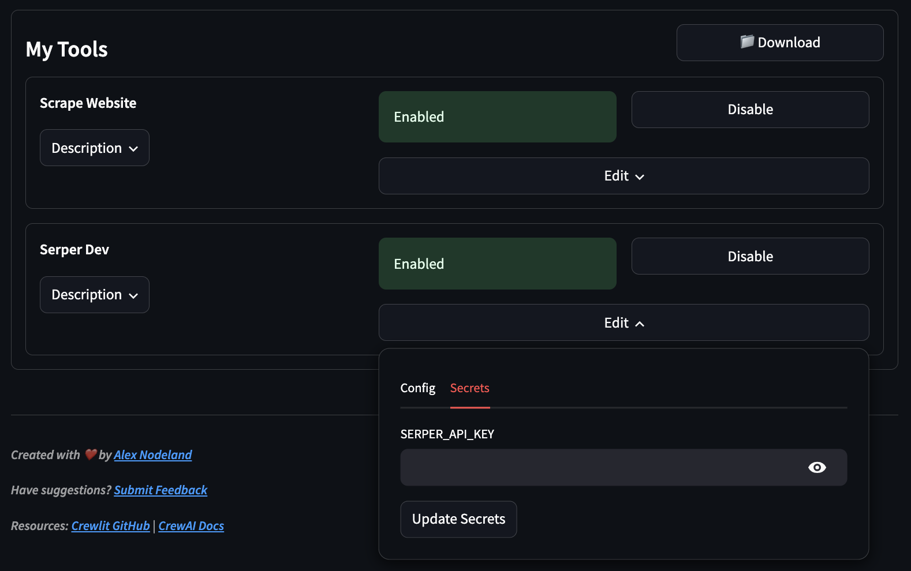
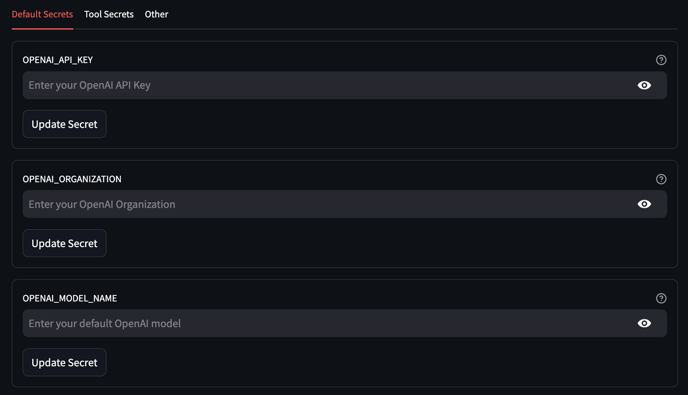

# User Guide

Welcome to the Crewlit App! This guide will walk you through the various functionalities and how to use the app effectively.

## Table of Contents

- [Overview](#overview)
- [Task Management](#task-management)
- [Agents Configuration](#agents-configuration)
- [Crew Configuration](#crew-configuration)
- [Tool Configuration](#tool-configuration)
- [Secrets Management](#secrets-management)

## Overview

The Crewlit app allows you to create and manage AI agents, tasks, and crews for powerful multi-agent automations.

## Task Management

Define objectives for your AI agents. Manage and edit tasks effectively:

1. Navigate to the "Tasks" section from the sidebar.
2. Click "Add Task" to create a new task or select an existing task to edit.

## Agents Configuration

Create specialized AI agents with unique roles. Here's how you can configure an agent:

1. Go to the "Agents" section from the sidebar.
2. Click "Add Agent" to create a new agent or select an existing agent to edit.
3. Define the agent's role, backstory, and goal.

## Crew Configuration

Assemble AI teams for complex workflows and configure settings for your agents. Here is how to configure your crew:

1. Navigate to the "Crews" section from the sidebar.
2. Click "Create Crew" to set up a new crew or select an existing crew to edit.

### Agent Settings

Adjust settings for your agents, including model name, temperature, and more:

1. Within the "Crews" section, select the crew you want to configure.
2. Click on an agent within the crew to access and adjust their settings.

## Tool Configuration

Add powerful capabilities to your agents by configuring various tools:

1. Go to the "Tools" section from the sidebar.
2. Click "Add Tool" to enable a new tool or select an existing tool to edit.

## Secrets Management

Manage your API keys and other secrets securely:

1. Navigate to the "Config" section from the sidebar.
2. Click on "Secrets" to manage your API keys and other sensitive information.

## Getting Started

1. **Create Agents**: Go to the "Agents" section and define your agents with specific roles and backstories.
2. **Configure Agents**: Set up your agent's LLM settings, including model type and other parameters.
3. **Create Crews**: Assemble a crew of agents for a particular task by configuring the crew settings.
4. **Add Tasks**: Define and manage tasks that your agents will perform.
5. **Enable Tools**: Integrate tools to enhance your agent's capabilities.
6. **Manage Secrets**: Securely store and manage API keys and other sensitive information.

For more detailed instructions and advanced configurations, feel free to open an issue or refer to the [Crewlit GitHub repo](https://github.com/alexnodeland/crewlit).
