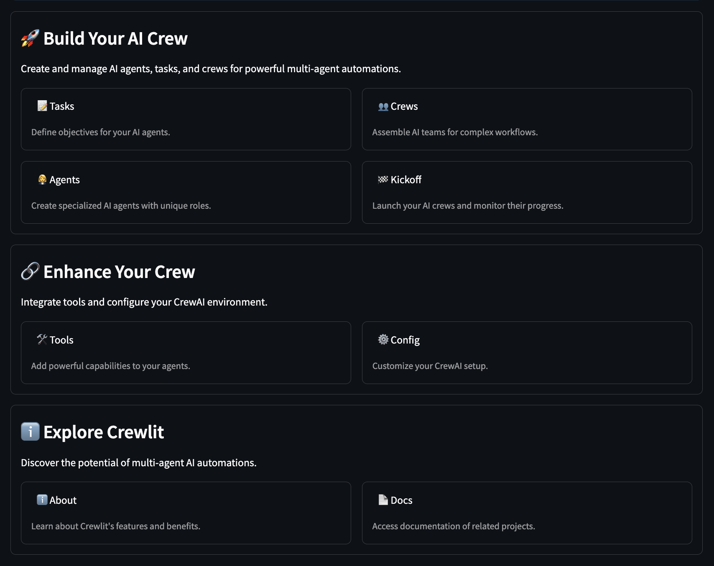

# 🚣 Crewlit

Crewlit is an open-source Streamlit application that brings the power of CrewAI to your browser. It provides a user-friendly interface for creating, managing, and executing AI agent crews, making multi-agent AI systems accessible to everyone.



## 🌟 Features

- **AI Agent Management**: Create and customize AI agents with specific roles, backstories, and goals.
- **Task Definition**: Define tasks for your AI agents to accomplish.
- **Crew Assembly**: Combine agents and tasks to form powerful AI crews.
- **Tool Integration**: Enable and configure various tools to enhance your agents' capabilities.
- **Configuration Management**: Set up global configurations, including API keys and default settings.
- **Execution Dashboard**: Launch and monitor your AI crews' progress in real-time.
- **User-Friendly Interface**: Intuitive Streamlit-based UI for easy navigation and management.

## 🚀 Getting Started

### Prerequisites

- Python 3.12 or higher
- Poetry for dependency management

### Installation

1. Clone the repository:

```bash
git clone https://github.com/alexnodeland/crewlit.git
cd crewlit
```

2. Run the application:

   a. Using the provided script (recommended):

    ```bash
    ./scripts/run.sh
    ```

    This script will:
    - Check if Poetry is installed and install it if necessary
    - Install or update project dependencies
    - Run the Streamlit app

   b. Alternatively, if you prefer manual setup:

    ```bash
    poetry install && poetry run app
    ```

    This command installs dependencies and runs the app using Poetry.

3. Open your browser and navigate to [`http://localhost:8501`](http://localhost:8501) to start using Crewlit!

## 🔗 Related Projects

- [CrewAI](https://github.com/joaomdmoura/crewAI): The underlying framework for multi-agent AI systems.
- [Streamlit](https://github.com/streamlit/streamlit): The web app framework used for the user interface.

## 📄 License

Crewlit is open-source software licensed under the MIT license. See the [LICENSE](LICENSE) file for more details.

## 🙏 Acknowledgements

I'd like to thank the creators of [CrewAI](https://crewai.com/) ([@joaomdmoura](https://github.com/joaomdmoura/)), [Streamlit](https://streamlit.io/), and all the other open-source projects that make Crewlit possible.

## 🤝 Support

If you encounter any issues or have questions, please [open an issue](https://github.com/yourusername/crewlit/issues) on the GitHub repository.

---

Made with ❤️ by [@alexnodeland](https://github.com/alexnodeland)